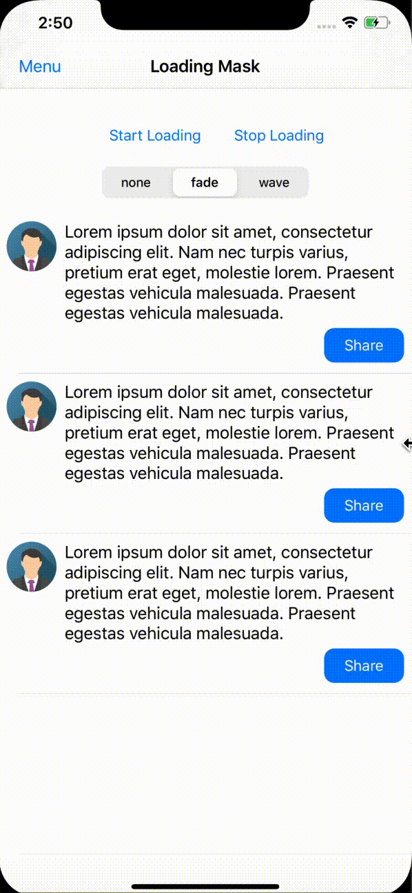
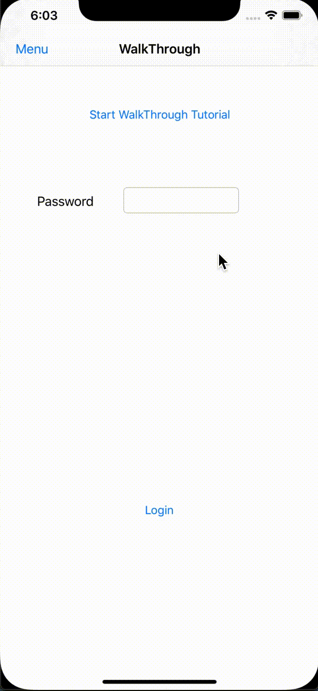
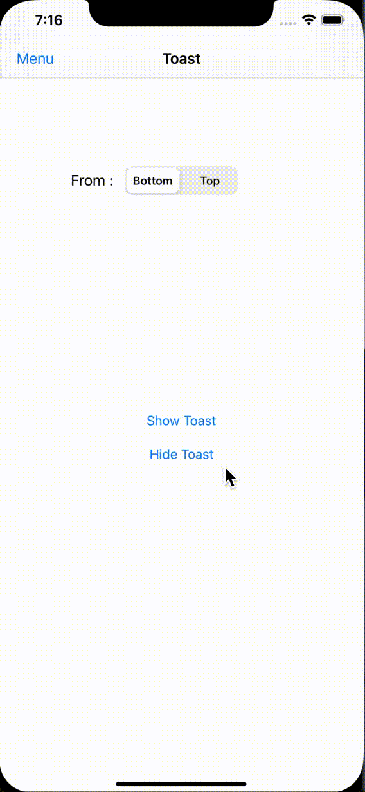

# Welcome to SafUITools!

SafUITools is a set of utilities to create modern and intuitive iOS application.

# Adding SafUITools via CocoaPods

Add SafUITools to your PodFile:

    pod 'SafUITools', :git => 'https://github.com/SafwenD/SafUITools.git'

    
Then, run the following command:

    pod install

# UI Tools

- [LoadingMask](#loadingmask)
- [WalkThrough](#walkthrough)
- [Toast](#toast)


# LoadingMask

LoadingMask is a tool to apply a skeleton mask on a UIView and it's subviews that looks like the Facebook loader.

### Example

Fade Animation  | Wave Animation
------------- | -------------
  | 

### How to use

You need to import the SafUITools Framework
```swift
import SafUITools
 ```   
To apply the mask on your view and it's subviews you need to use this method and specify the cell identifier if your applying the loader on tableView, and ofcourse specify an animation style if you want to. The loader will be applied on the view and it's subviews and it will adapt to a cornerRadius of it's already applied and will show multiLine mask for UITextView and UILabel depending on it's height. 
```swift
LoadingMask.shared.applyLoader(onView view: UIView, tableViewCellIdenitifer: String?, animationStyle: ShadowLoaderAnimationStyle = .wave)
```  
To remove the mask call this method : 
```swift
LoadingMask.shared.removeLoader(fromView view: UIView)
```    
To check if a mask is already applied on a view call this method : 
```swift
LoadingMask.shared.isMasking(view: UIView)
```    
You can set configuration for the LoadingMask by setting these variables : 
```swift
LoadingMask.shared.defaultTableViewCellCount: Int = 3 // use this variable to set the number of cells to show loading when applying mask on a tableView
```    

# WalkThrough

WalkThrough is a tool to create a step by step tutorial fully customizable for features in the application or to help the use understand the User Interface with intuitive animations and hints. The tutorial highlights a UIView with circles and shows a hint about the view filled with text, when tapping on the highlighted view the WalkThrough passes to the next tip.

### Example

WalkThrough example with a login form containing: UIBarButtonItem, UILabel, UITextField and UIButton



### How to use

It's very simple to use the WalkThrough by providing an array of views, infos about the views and a style for every view. 

First you need to create a **WalkThroughTip** and it's style of type **WalkThroughTipStyle** :
```swift
struct WalkThroughTip {
    var hightlightedView: UIView? // the view to highlight
    var customInfoView: UIView? // a custom info view for the tip
    var text: String? // text to show in a label as an info view
    var style: WalkThroughTipStyle // style of the tip
}
    
struct WalkThroughTipStyle {
    var backgroundColor: UIColor // background color of the walkthrough
    var circlesColor: UIColor // color of the highlighting cirlces
    var infoLabelTextColor: UIColor // color of the info label
    var infoLabelBackgroundColor: UIColor // background color of the info label
    var shouldUseCircularHighlight: Bool // should use circular highlight or use default view frame
}
```    
For a UIBarButtonItem you need to get the view object by using this line : 
```swift
let menuButtonItem: UIBarButtonItem
let menuButton = menuButtonItem.value(forKey: "view") as? UIView
```

Example of Style: 
```swift
let style = WalkThroughTipStyle(backgroundColor: UIColor(red: 4/256, green: 128/256, blue: 222/256, alpha: 1.0),
                                   circlesColor: UIColor(red: 4/256, green: 200/256, blue: 222/256, alpha: 1.0),
                             infoLabelTextColor: .black,
                       infoLabelBackgroundColor: .white)
                                        
``` 
 Example of tip: 
```swift 
let tip = WalkThroughTip(hightlightedView: menuButton,
                           customInfoView: nil,
                                     text: "This is the menu button, it's a beautiful button made by me... tap it to show the menu on the left please...",
                                    style: style)
```

Then you optionnaly can set the WalkThrough preferences by modifying the default values : 
```swift
public var defaultHighlightPadding: CGFloat // padding for the highlighting layer
public var defaultHighlightCirclesCount: Int // number of circles to draw
public var defaultInfoViewWidth: CGFloat // width of the info view
public var defaultInfoAnimationDuration: TimeInterval // info view appearing duration
```    
Then add as much tips as you want: 
```swift
WalkThrough.shared.addTip(tip: tip1)
WalkThrough.shared.addTip(tip: tip2)
...
```
You can set a closure to notify you when the WalkThrough is finished :
```swift
WalkThrough.shared.walkThroughDidFinishCallBack = { ()->Void in
    print("finished walkthrough !")
}
```    
Then to start the WalkThrough you need to call this method : 
```swift
WalkThrough.shared.walkThrough()
```

# Toast

TinyToast is a simple animated toast that appears with a text on top or bottom of a view with a sliding animation.

### Example



### How to use

To show a toast from bottom use this method : 
```swift
func tinyToast(withText text: String, font: UIFont, backgroundColor: UIColor, textColor: UIColor, animationDirection: ToastSlidingDirection, disappearAfter: TimeInterval?)
```
Like this if you want the toast to appear for one second, if you want it to stay there: juste pass nil in the **disappearAfter** param : 
```swift
self.view.tinyToast(withText: text, animationDirection: direction, disappearAfter: 1.0)
```
To force the Toast to disappear, call this method: 
```swift
self.view.removeTinyToast()
```

# Author

Safwen DEBBICHI, safwen.debbichi.91@gmail.com

# Licence

SafUITools is available under the MIT license. See the LICENSE file for more info.
